## Viet-Anh Nguyen · Senior ML Engineer

**Edge AI & Inference Economics · Creator of AnyLabeling (3.3k⭐)**

> **I build AI that runs on real hardware, for real people, at low cost.**

**8+ years shipping production ML.** First ML Lead at [Scopic Software](https://scopicsoftware.com) (USA, remote) since 2025. Previously: autonomous driving at VinAI, AI Core Platform at Samsung SDS (10-engineer team, 4 markets, 3 enterprise customers).

**Open-source creator.** 4,000+ GitHub stars across 25+ projects. Founder of [Neural Research Lab](https://www.nrl.ai).

**Edge AI specialist.** C++, NCNN, TensorRT, ONNX Runtime, llama.cpp. On-device deployment from Jetson Nano to RTX GPUs.

### 🚀 Now Building

- **[EdgeVox](https://edgevox.nrl.ai)** — Offline voice-agent framework for robots. ROS2-native, ~800ms TTFT on Jetson Orin Nano, 16 languages, safety-first agent architecture. Shipping since early 2026.
- **[AnyLabeling](https://github.com/vietanhdev/anylabeling) Enterprise Hub** — Extending local-first labeling tool with team collaboration layer.

### 📦 Featured Open Source

| Project | What | Signal |
|---|---|---|
| **[AnyLabeling](https://github.com/vietanhdev/anylabeling)** | AI-assisted data labeling with SAM + YOLO | **3.3k⭐** · 350k+ devs reached |
| **[EdgeVox](https://edgevox.nrl.ai)** | Offline voice agents for robots | 9 releases · PyPI · ROS2 |
| **[LlamaAssistant](https://llama-assistant.nrl.ai)** | Local LLM desktop assistant | **530⭐** · llama.cpp + RAG |
| **[DaisyKit](https://daisykit.nrl.ai)** | Cross-platform AI SDK | **312k+** PyPI downloads · starred by NCNN's author |
| **[OpenADAS](https://github.com/vietanhdev/open-adas)** | Driver-assistance on Jetson Nano | **490⭐** · NVIDIA Jetson Project of the Month |
| **[samexporter](https://github.com/vietanhdev/samexporter)** | SAM model → ONNX exporter | **399⭐** |

More projects: [vietanh.dev/projects](https://www.vietanh.dev/projects)

### 🏆 Credentials

- AWS Certified Machine Learning — Specialty (2025)
- NVIDIA Jetson Project of the Month — OpenADAS (2021)
- IEEE BigData 2023 publication — Active learning for object detection
- Samsung SDS Employee of the Year — AI Research Lab (2022)

### 📈 Stats

### 🔗 Links

- **Blog:** [vietanh.dev](https://www.vietanh.dev) — writing on AI security, agent sandboxes, edge inference
- **Lab:** [nrl.ai](https://www.nrl.ai) — Neural Research Lab
- **HuggingFace:** [@vietanhdev](https://huggingface.co/vietanhdev)
- **LinkedIn:** [vietanhdev](https://www.linkedin.com/in/vietanhdev/)

Based in Hanoi, Vietnam (UTC+7) · 2+ years async-first collaboration with US-based team · Open to technical conversations.
